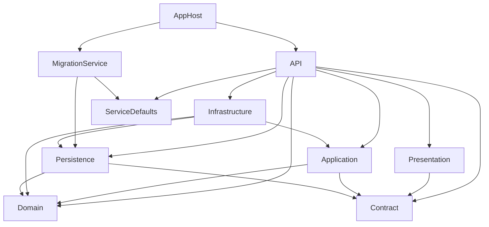

# ARCHITECTURE.md - FastBite Solution

## Architecture Style

FastBiteGroup uses **Clean Architecture** with CQRS through MediatR. It is a **Modular Monolith**, not microservices.

The project now supports a polyglot persistence direction:
- PostgreSQL/EF Core for relational data and transactional state.
- MongoDB.Driver scaffold for future document data, messages, notifications, projections, and outbox workflows.

---

## Layer Responsibilities

| Layer | Project | Dependencies | Role |
|---|---|---|---|
| Domain | `FastBiteGroup.Domain` | None | Entities, business rules, domain exceptions, repository interfaces, `IUnitOfWork` |
| Contract | `FastBiteGroup.Contract` | MediatR, EF Core package for query extensions | Commands, queries, responses, Result pattern, shared outbox contracts |
| Application | `FastBiteGroup.Application` | Domain + Contract | Use cases, pipeline behaviors, validators, mappers |
| Persistence | `FastBiteGroup.Persistence` | Domain + Contract + EF Core + MongoDB.Driver | EF DbContext, Identity persistence, repositories, MongoDB context/outbox |
| Infrastructure | `FastBiteGroup.Infrastructure` | Application + Domain + Persistence | Redis cache, JWT, Identity auth adapter |
| Presentation | `FastBiteGroup.Presentation` | Contract | Minimal API endpoints |
| API | `FastBiteGroup.API` | All runtime layers | Composition root, middleware, DI, Swagger |
| MigrationService | `FastBiteGroup.MigrationService` | Persistence + ServiceDefaults | Migrations and seed data |
| AppHost | `FastBiteGroup.AppHost` | Aspire SDK | Local orchestration |
| ServiceDefaults | `FastBiteGroup.ServiceDefaults` | Aspire + OTel | Observability and health defaults |

---

## Dependency Flow

```text
HTTP Client
  -> API middleware
  -> Presentation endpoint
  -> MediatR command/query
  -> Application handler
  -> Domain rules + Contract DTOs
  -> Persistence/Infrastructure implementations via abstractions
```

Persistence is database-specific. EF Core and MongoDB.Driver must not leak into Application handlers except through abstractions/contracts intentionally placed in Domain or Contract.

---

## MediatR Pipeline

Behaviors execute in registration order:

```text
PerformancePipelineBehavior
  -> TracingPipelineBehaviors
    -> TransactionPipelineBehaviors
      -> ValidationPipelineBehaviors
        -> Handler
```

`TransactionPipelineBehaviors` uses `IUnitOfWork`, which is the EF Core/PostgreSQL unit of work. It is not a distributed transaction across PostgreSQL and MongoDB.

---

## Result Pattern

Application handlers return `Result<T>` or `Result`. Failure is represented with `Error`, not raw exceptions from normal business flow.

Endpoint pattern:

```csharp
var result = await sender.Send(command, cancellationToken);
return result.IsFailure ? HandleFailure(result) : Results.Ok(result.Value);
```

---

## Repository and Unit of Work

Relational persistence:

```text
IRepositoryBase<TEntity, TKey>     Domain abstraction
RepositoryBase<TEntity, TKey>      EF Core implementation
IRefreshTokenRepository            Domain abstraction
RefreshTokenRepository             EF Core implementation
IUnitOfWork                        EF Core transaction boundary
EFUnitOfWork                       Persistence implementation
```

MongoDB persistence:

```text
MongoDbContext                     Thin wrapper around IMongoDatabase
MongoDocumentBase<TKey>            Base for Mongo documents
IIntegrationOutboxStore            Contract abstraction
MongoIntegrationOutboxStore        MongoDB implementation
MongoIndexInitializer              Hosted service for Mongo indexes
```

Do not create one generic repository that tries to cover both EF Core and MongoDB. Use separate abstractions per storage model and use case.

---

## Polyglot Consistency Pattern

When a future use case needs both SQL and MongoDB:

1. Choose one database as the source of truth for that use case.
2. Write the source-of-truth data and an outbox message in the same database boundary.
3. Process the outbox asynchronously.
4. Use idempotency keys and inbox/processed-message tracking to avoid duplicates.
5. Retry failed side effects.

Recommended future chat split:
- SQL source of truth: users, conversations, membership, permissions.
- MongoDB source of truth: message content, notifications, delivery logs.
- SQL projections or summaries can be updated from Mongo outbox events.

No distributed transaction across SQL and MongoDB should be introduced without explicit approval.

---

## Token Security Architecture

```text
JWT access token
  -> validated by JwtBearer middleware
  -> jti blacklisted in Redis on logout
  -> TokenBlacklistMiddleware rejects revoked sessions

Refresh token
  -> stored in PostgreSQL
  -> rotated by marking old token as used
  -> bulk revoked through IRefreshTokenRepository
```

---

## Module Relationships



---

## Architecture Tests

Architecture tests currently pass 10/10. Important enforced rules include:
- Domain does not depend on Application, Persistence, or Infrastructure.
- Application does not depend on Persistence or Infrastructure.
- Presentation does not depend on Domain or Persistence.
- Contract does not depend on Application or Persistence.
- Entities live in Domain.
- Domain exceptions inherit `DomainException`.
