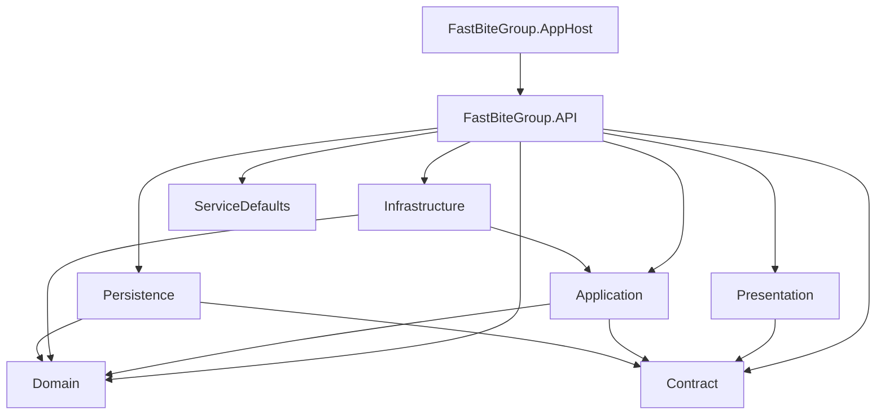

# ARCHITECTURE.md — FastBite Solution

## Architecture Style

**Clean Architecture** (a.k.a. Onion Architecture) with **CQRS** via MediatR.

> **NOT Microservices.** This is a deliberately scoped Modular Monolith, appropriate for the current team size and business complexity.

---

## Layer Responsibilities

| Layer | Project | Dependencies | Role |
|---|---|---|---|
| **Domain** | `FastBiteGroup.Domain` | None | Entities, business rules, domain exceptions, repository/UoW interfaces |
| **Contract** | `FastBiteGroup.Contract` | MediatR (IRequest) | Shared commands, queries, responses, Result pattern |
| **Application** | `FastBiteGroup.Application` | Domain + Contract | Use case handlers, pipeline behaviors, validators, mappers |
| **Persistence** | `FastBiteGroup.Persistence` | Domain + Contract + EF Core | DbContext, EF repository implementations, UoW implementation |
| **Infrastructure** | `FastBiteGroup.Infrastructure` | Application + Domain | Redis cache, JWT, external service adapters |
| **Presentation** | `FastBiteGroup.Presentation` | Contract + MediatR | Minimal API endpoint definitions (thin mapping layer) |
| **API** | `FastBiteGroup.API` | All layers | Composition root, middleware pipeline, DI wiring |
| **AppHost** | `FastBiteGroup.AppHost` | API + Aspire SDK | .NET Aspire orchestration host |
| **ServiceDefaults** | `FastBiteGroup.ServiceDefaults` | Aspire + OTel | Shared observability configuration |

---

## Dependency Flow

```
External Request
      │
      ▼
┌──────────────────┐
│   FastBiteGroup  │  ← Composition Root
│      .API        │     Middleware, DI wiring
└──────────┬───────┘
           │ dispatches via MediatR
           ▼
┌──────────────────┐
│  Presentation    │  ← Maps HTTP → Command/Query
│  (Minimal APIs)  │     Returns IResult
└──────────┬───────┘
           │ ICommand / IQuery
           ▼
┌──────────────────┐
│   Application    │  ← Business Logic
│  (Use Cases)     │     Handlers, Behaviors, Validators
└──────┬───────────┘
       │
  ┌────┼────────────────┐
  │    │                │
  ▼    ▼                ▼
Domain  Contract    Infrastructure
(pure)  (shared)    (Redis, JWT)
  │
  ▼
Persistence
(EF Core, PostgreSQL/SQL Server)
```

---

## MediatR Pipeline Order

Behaviors execute in registration order (outermost → innermost):

```
Request
  → PerformancePipelineBehavior   (wraps everything — logs if > 5000ms)
    → TracingPipelineBehaviors    (logs success/failure + elapsed time)
      → TransactionPipelineBehaviors  (wraps commands in DB transaction via IUnitOfWork)
        → ValidationPipelineBehaviors (runs FluentValidation — short-circuits on error)
          → Handler                   (actual business logic)
```

**Critical design note**: `TransactionPipelineBehaviors` wraps ALL `ICommand` handlers. Queries bypass the transaction behavior because they return `Result` but the behavior checks `where TResponse : Result`.

---

## Request Flow (Detailed)

```
Client HTTP Request
        │
        ▼
[TokenBlacklistMiddleware]    ← Checks Redis for revoked JTI
        │
        ▼
[JwtBearerAuthentication]     ← Validates JWT signature, expiry
        │
        ▼
[Presentation Layer]          ← AuthApi / ProductApi
        │ ISender.Send(command)
        ▼
[MediatR Pipeline]
    ├── PerformancePipelineBehavior
    ├── TracingPipelineBehaviors
    ├── TransactionPipelineBehaviors  ← BeginTransaction
    ├── ValidationPipelineBehaviors   ← FluentValidation
    └── CommandHandler
            │ IRepositoryBase<T>.Add/Update/Remove
            ▼
    [ApplicationDbContext]    ← EF Core
            │
            ▼
    [PostgreSQL / SQL Server]
        │
        ▼
[Result<T>] returned up the chain
        │
        ▼
[ApiEndpoint.HandleFailure()]  ← Maps errors to ProblemDetails
        │
        ▼
Client HTTP Response (200/400/401/404/409/500)
```

---

## Key Patterns

### Result Pattern (`Contract/Abstractions/Shared/`)

All Application responses use the Result monad — exceptions are never thrown from handlers:

```csharp
// Success
return Result.Success(value);

// Failure
return Result.Failure<AuthResponse>(Error.NullValue);

// In endpoint
if (result.IsFailure) return HandleFailure(result);
return Results.Ok(result.Value);
```

### Error Mapping in `ApiEndpoint`

Error codes are parsed by convention in `ApiEndpoint.GetStatusCode()`:
- Code contains `"NotFound"` → 404
- Code contains `"Conflict"` → 409
- Code contains `"Unauthorized"` → 401
- Code contains `"Forbidden"` → 403
- Default → 400

### Repository Pattern

```
IRepositoryBase<TEntity, TKey>  (Domain — interface)
        ↑
RepositoryBase<TEntity, TKey>   (Persistence — EF Core implementation — STUB)
        ↑
IRefreshTokenRepository          (Domain — specialized interface)
```

### Token Security Architecture

```
JWT Access Token (short-lived, ~60min)
    ├── Validated by JwtBearerAuthentication middleware
    └── Blacklisted in Redis on logout (key: auth:blacklist:jti:{jti})
            └── Checked by TokenBlacklistMiddleware (runs AFTER auth)

Refresh Token (long-lived, opaque string, stored in DB)
    ├── RefreshToken entity (Domain)
    ├── Rotation: MarkUsed() + issue new token
    ├── Revocation: Revoke() method
    └── Stored with: Token, Jti (links to AT), UserId, ExpiresAt, IsRevoked, IsUsed
```

---

## Module Relationships (Mermaid)



---

## Architecture Rules (Enforced by Tests)

| Rule | Test | Status |
|---|---|---|
| Domain ↛ Application | `Domain_ShouldNot_DependOnApplicationLayer` | ✅ Passing |
| Domain ↛ Persistence | `Domain_ShouldNot_DependOnPersistenceLayer` | ✅ Passing |
| Domain ↛ Infrastructure | `Domain_ShouldNot_DependOnInfrastructureLayer` | ✅ Passing |
| Application ↛ Persistence | `Application_ShouldNot_DependOnPersistenceLayer` | ⚠️ **Known violation** (see below) |
| Application ↛ Infrastructure | `Application_ShouldNot_DependOnInfrastructureLayer` | ✅ Passing |
| Presentation ↛ Domain | `Presentation_ShouldNot_DependOnDomainLayer` | ✅ Passing |
| Presentation ↛ Persistence | `Presentation_ShouldNot_DependOnPersistenceLayer` | ✅ Passing |
| Contract ↛ Application/Persistence | `Contract_ShouldNot_DependOnApplicationOrPersistence` | ✅ Passing |
| Entities reside in Domain | `Entities_ShouldResideIn_DomainLayer` | ✅ Passing |
| Domain Exceptions inherit DomainException | `DomainExceptions_ShouldInheritFrom_DomainException` | ✅ Passing |

### ⚠️ Known Violation: Application → Persistence

`TransactionPipelineBehaviors` injects `IUnitOfWork` (a Domain interface), but the Application project itself has no direct Persistence dependency at the code level. The Architecture test **passes** because Application.csproj has no `ProjectReference` to Persistence. However, this should be monitored if any code change introduces such a reference.

---

## Aspire Orchestration

```
FastBiteGroup.AppHost
  ├── postgres (Aspire.Hosting.PostgreSQL)
  │     └── database: "DefaultConnection"
  ├── redis (Aspire.Hosting.Redis)
  └── api (FastBiteGroup.API)
        ├── WaitFor: postgres, redis
        ├── WithReference: postgres → connection string injected
        ├── WithReference: redis → connection string injected
        └── WithEnvironment: LicenseKeyOptions__* → from secrets
```

Optional clients (both commented out by default):
- `fastbite-frontend` — detected by path convention
- `fastbite-desktop` — WPF app, Windows-only, detected by path
